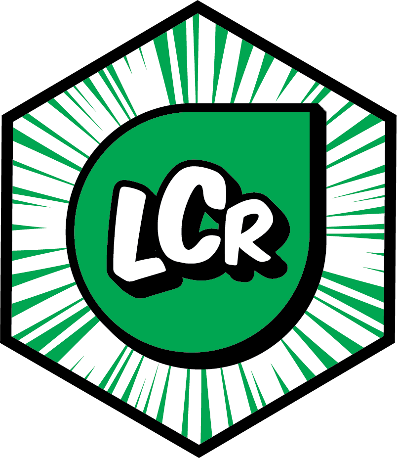

```{r, include = FALSE}
knitr::opts_chunk$set(
  collapse = TRUE,
  comment = "#>",
  fig.path = "man/figures/README-",
  out.width = "100%"
)
```
<a href="https://matildabrown.github.io/rWCVP/"></a>   

# LCr: An R package to generate minimal Least Concern Red List assessments

## Overview

Generate minimal documentation for a species expected to be Least Concern (see [IUCN Red List](https://www.iucnredlist.org/)). Submit to the IUCN Red List via [SIS Connect](https://connect.iucnredlist.org/) (registration needed)

## Installation

Not yet on [CRAN](https://CRAN.R-project.org), but you can install the development version from [GitHub](https://github.com/) with:

``` r
# install.packages("devtools")
devtools::install_github("stevenpbachman/LCr")
```

## Usage

The workflow is broken into several steps and each step can be run independently:

1.  `name_search_gbif` or `name_search_powo` to check name status against taxonomic name backbones
2.  `occs_gbif` gather occurrence records from GBIF
3.  `occs_clean` clean the occurrence data
4.  `make_sis_occs` convert an occurrence file into an IUCN Red List compatible file
5.  `sis_zip` generate and zip SIS csv datafiles

Function will allow single species or  multiple species if a dataframe is supplied

### Getting started

```{r example}
library(LCr)
## check a name against the GBIF 
name_search_gbif("Poa annua L.")

#etc...
```
